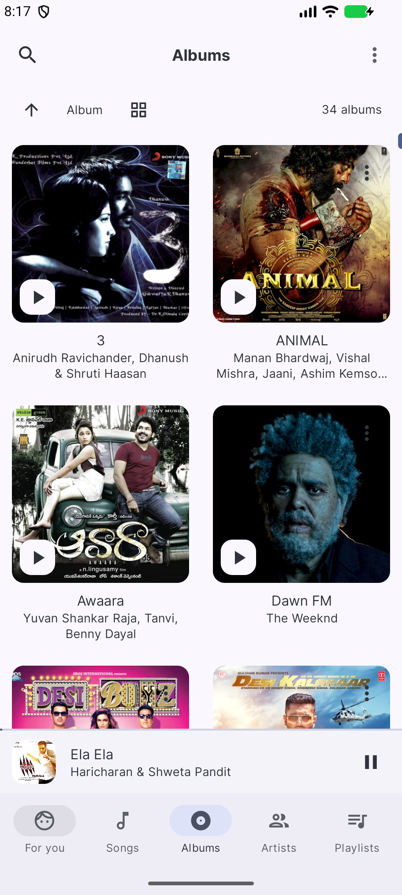
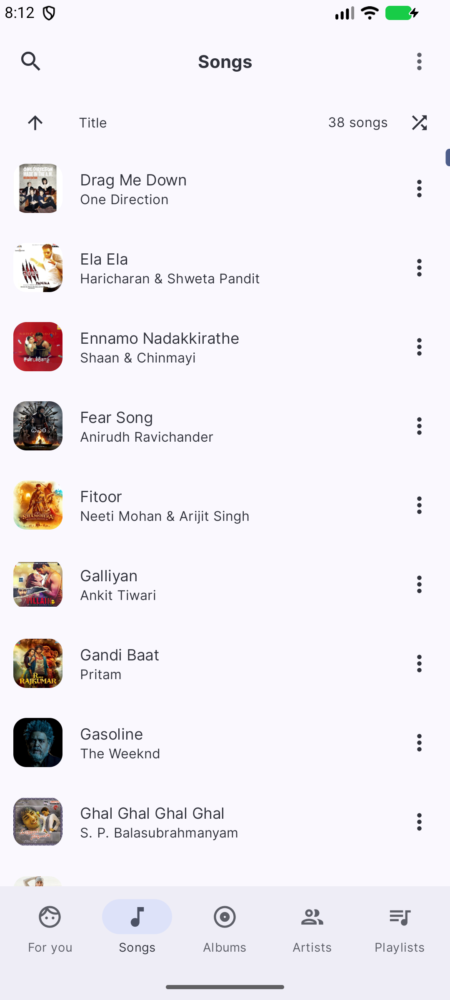
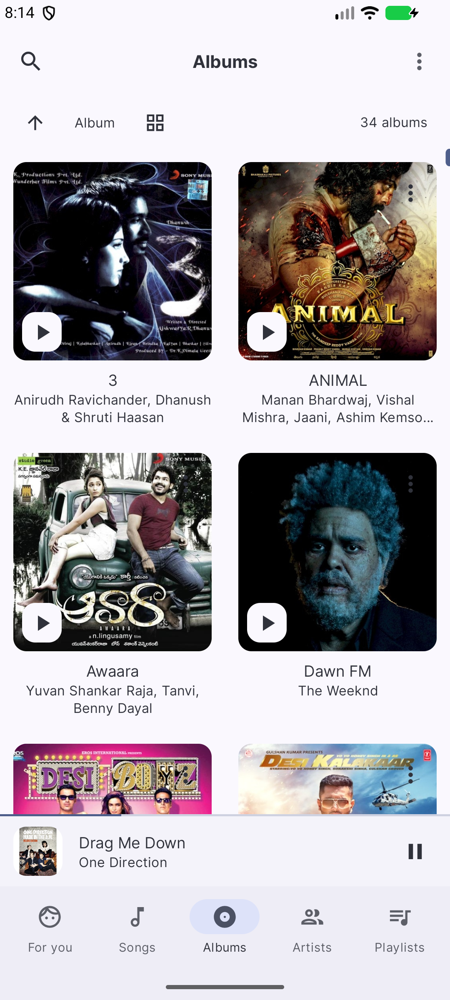
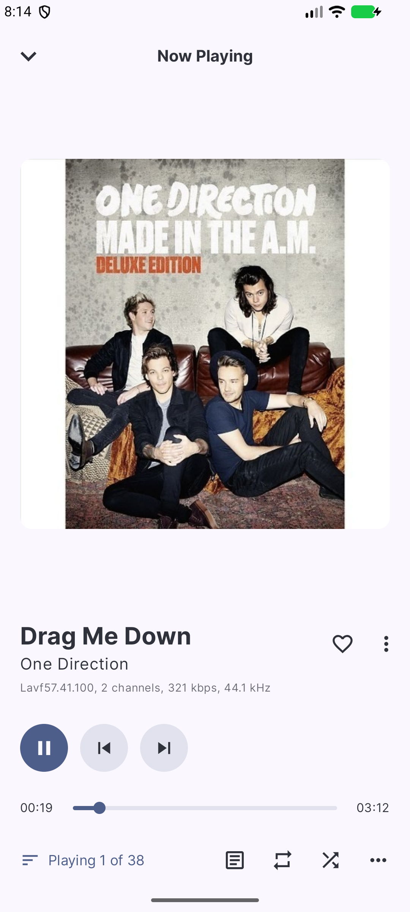
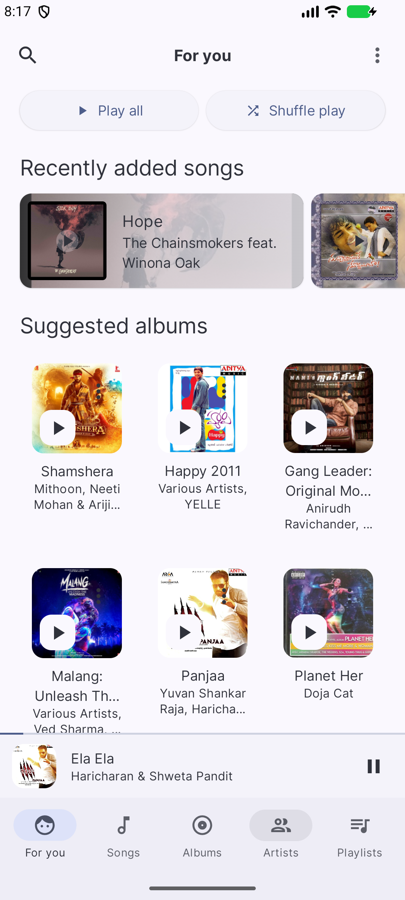

# KordX

[](LICENSE)
[](https://github.com/Sreecharannuthi/kordx/releases/latest)
[](https://github.com/Sreecharannuthi/kordx/actions/workflows/ci.yml)
[-3DDC84?logo=android&logoColor=white)]()
[]()
[]()
[]()

> An offline-first, open-source Android music player built with Jetpack Compose and Material 3.

KordX is a lightweight, privacy-respecting music player for the music you already
own. It scans the audio files on your device, organizes them into a browsable
library, and plays them with no account, no telemetry, and no network required
for playback.

---

## Features

- **Offline playback** — your library lives on your device; nothing is uploaded.
- **Folder & library browsing** — browse by songs, albums, artists, genres, or raw
  filesystem folders, including a Storage Access Framework (SAF) picker for
  managing which media folders are indexed.
- **Playlists & favorites** — create playlists, mark favorites, and resume exactly
  where you left off (queue, shuffle, and repeat state are persisted).
- **Android Auto** — control playback from your car's head unit via the Media3
  media-browse session.
- **Material 3 design** — dynamic color, light/dark themes, and a responsive
  Compose UI.
- **Multi-language** — 18 locales shipped out of the box via a TOML-based i18n pipeline
  i18n (de, en, es, fa, fi, fr, hi, it, ja, pl, pt, ro, ru, te, tr, uk, vi, zh-Hans).
- **Sleep timer, search, and sorting** — the everyday conveniences you expect
  from a music player.

---

## Screenshots

| Home (For You) | Songs | Albums | Now Playing | Artists |
|:---:|:---:|:---:|:---:|:---:|
|  |  |  |  |  |

---

## Architecture

KordX is a multi-module Gradle project. Each module has a single, well-defined
responsibility:

```
┌─────────────────────────────────────────────────────────────┐
│  app        Android shell: Compose UI, services, ViewModels │
│            (radio / media-browse / settings / i18n loader)   │
├──────────┬───────────────────────────┬──────────────────────┤
│  core    │  infra                    │  metaphony            │
│  pure    │  Room persistence:        │  native taglib-backed │
│  Kotlin  │  database, DAOs, stores  │  metadata (JNI +      │
│  utils & │  (playlists, favorites,  │  vendored taglib/     │
│  models  │   playback state)        │  utfcpp)              │
└──────────┴───────────────────────────┴──────────────────────┘
```

| Module      | Language        | Responsibility                                              |
|-------------|-----------------|-------------------------------------------------------------|
| `app`       | Kotlin + Compose| UI, Android services, ViewModels, media session, i18n glue  |
| `core`      | Kotlin          | Pure utilities, shared data models, Room type converters     |
| `infra`     | Kotlin          | Room database, DAOs, persistence stores                      |
| `metaphony` | Kotlin + C/C++  | Native audio metadata reading via vendored taglib (JNI)      |

---

## Tech Stack

- **Language:** Kotlin 2.1 (official code style)
- **UI:** Jetpack Compose 1.7 / Material 3 1.3
- **Persistence:** Room 2.6 (+ KSP)
- **Media:** AndroidX Media3 1.7 (session / `ExoPlayer`) and AndroidX Media
- **Metadata:** [taglib](https://taglib.org/) (vendored C++ via JNI in `metaphony`, with utfcpp)
- **i18n:** TOML-based translation sources compiled to bundled JSON assets
- **Build:** Gradle with a version catalog, detekt, and kover
- **Minimum SDK:** 31 (Android 12) · **Target / Compile SDK:** 35

---

## Build & Run

Prerequisites:

- **Android Studio** (latest stable, Hedgehog or newer)
- **JDK 17**
- **Android SDK 35** (platform + build-tools) and the **Android NDK (r27)**
- **CMake 3.22+** (required to build the native `metaphony` module)
- **Node.js 22** (optional — only to regenerate i18n assets locally)

Steps:

```bash
git clone https://github.com/Sreecharannuthi/kordx.git
cd kordx

# i18n assets are committed to the repo, so a normal build needs no extra generation step.

# build a debug APK
./gradlew :app:assembleDebug
```

Then open the project in Android Studio and run the `:app` configuration on a
device or emulator. See [BUILDING.md](BUILDING.md) for headless / CI build
details and troubleshooting.

---

## Contributing

Contributions are welcome! Please read [CONTRIBUTING.md](CONTRIBUTING.md) for
the development setup, code-style expectations, and the pull-request process.

---

## License

KordX is licensed under **AGPL-3.0**.

## Acknowledgments

- [taglib](https://taglib.org/) — audio metadata reading.
- [utfcpp](https://github.com/nemtrif/utfcpp) — UTF-8 handling in the native layer.

- The Android Jetpack and JetBrains Kotlin teams.
